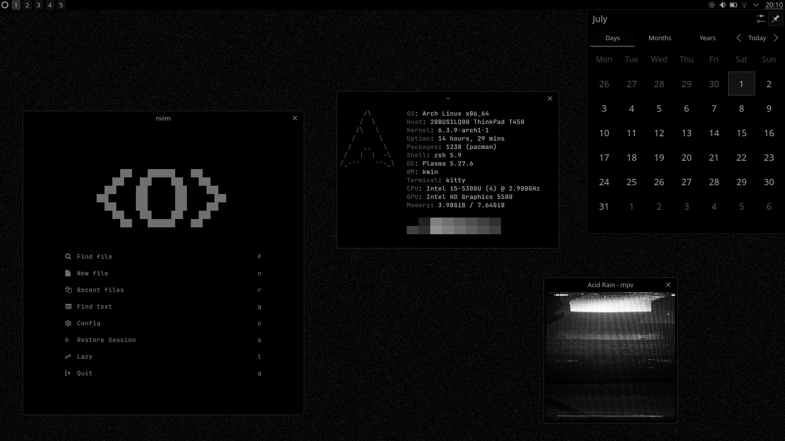

# eyes



Monochrome theme for KDE Plasma.

## Installation

To install it, run

```bash
git clone https://github.com/amedoeyes/eyes-kde
cd eyes-kde
./install.sh
```

## Usage

You'll find the theme in Settings > Appearance > Global Theme.
Simply select it and hit apply.

## Uninstall

To uninstall, run

```bash
./uninstall.sh
```
